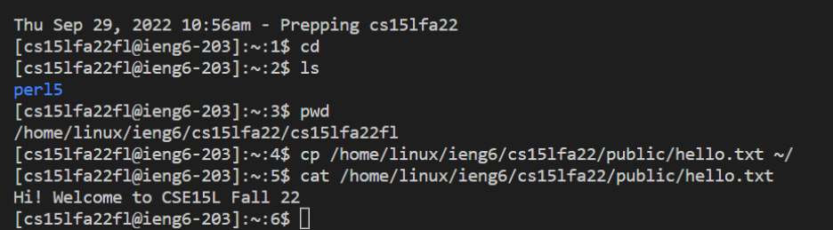
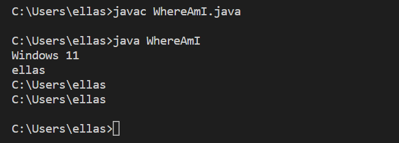
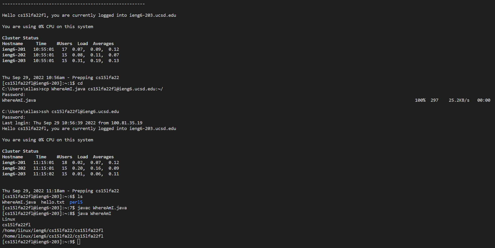
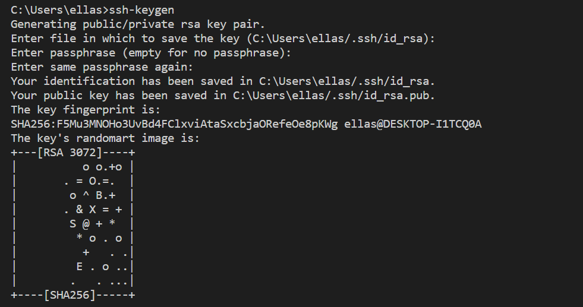
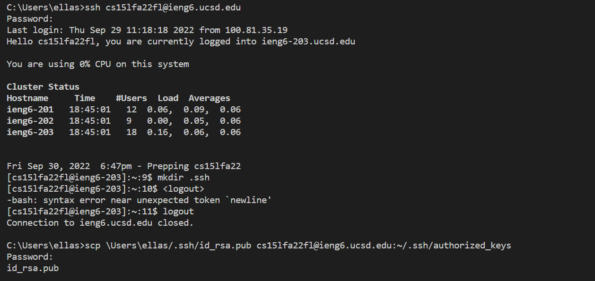
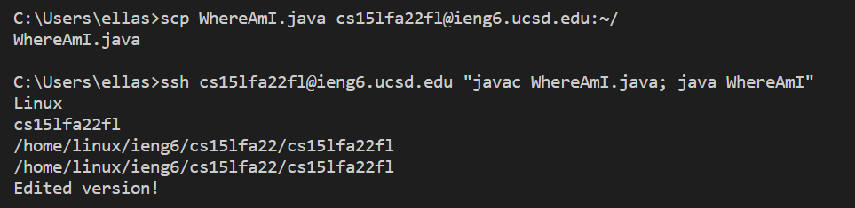

## Week 1 Lab Report
---

## Remote Access Tutorial

### Step 1: Install Visual Studio Code

- Download vscode and follow the setup instructions
- When you’re done, the window should look like this:


### Step 2: Remotely Connect

- If you're on a Windows computer, check if you already have the OpenSSH client installed. If not, install it [here](https://learn.microsoft.com/en-us/windows-server/administration/openssh/openssh_install_firstuse?tabs=gui).
- Open a new terminal in VSCode
- Input the command `ssh cs15lfa22!!@ieng6.ucsd.edu` with the last 2 digits of *your* username in place of `!!`
- Type `yes` when prompted and enter, then enter your password
> I had an issue at first! Make sure to reset your password before entering it for the first time. Some of my lab partners also encountered issues with their passwords, so if resetting it doesnt work, try entering your AD password.
- You should now see something similar to this in your console:


- You should now be connected to the remote server!

### Step 3: Test Commands

- Here are some examples of commands you can try out:
  - `cd`
  - `ls -lat`
  - `ls -a` 
  > The `ls` commands will list the files in the given directory.
  - `cp /home/linux/ieng6/cs15lfa22/public/hello.txt ~/`
  - `cat /home/linux/ieng6/cs15lfa22/public/hello.txt`



- Before moving onto the next step where we will test out copying files remotely using `scp`, we need to exit the remote server. You can use either Ctrl + D or enter the command `exit`.

### Step 4: Moving Files

- Create an example file to copy. This file is going to give us information about the system we are working with.
- Copy
  ```
  class WhereAmI {
    public static void main(String[] args) {
      System.out.println(System.getProperty("os.name"));
      System.out.println(System.getProperty("user.name"));
      System.out.println(System.getProperty("user.home"));
      System.out.println(System.getProperty("user.dir"));
    }
  }
  ```
  into a file called `WhereAmI.java` and save it onto your computer.
- Compile and run the program:
  `javac WhereAmI.java`
  `java WhereAmI`



- Now in the same terminal, run the command `scp WhereAmI.java cs15lfa22!!@ieng6.ucsd.edu:~/` and enter your password again.
- Input the command `cs15lfa22!!@ieng6.ucsd.edu` and run the program again:
  `javac WhereAmI.java`
  `java WhereAmI`



- See how the output is different? The values reflect the new remote server!

### Step 5: Setting an SSH Key

- We can skip the password step by setting up `ssh-keygen`
- In the terminal on your computer, run `ssh-keygen`
- When asked for which file to save the key, just press enter to select the default file



- Copy the public key by entering `ssh cs15lfa22!!@ieng6.ucsd.edu` and your password onto the client
- On the server, enter `mkdir .ssh` and then log out
- On the client, enter `scp \Users\ellas/.ssh/id_rsa.pub cs15lfa22!!@ieng6.ucsd.edu:~/.ssh/authorized_keys` with the path to your own file



- Now it is a lot quicker to copy and run files remotely!

### Step 6: Optimizing Remote Running

- To practice this easier way to copy and run files remotely, make an edit to the `WhereAmI.java` file locally
- Enter `scp WhereAmI.java cs15lfa22fl@ieng6.ucsd.edu:~/` into the terminal
- Enter `ssh cs15lfa22fl@ieng6.ucsd.edu "javac WhereAmI.java; java WhereAmI"` into the terminal
- You should see the new output, with less steps to find it!



> You can run a command directly by putting it in quotes, and combine multiple commands in one line by separating them with a semicolon

**Now you should have an idea of how to copy and run files remotely using SSH and SCP!**
