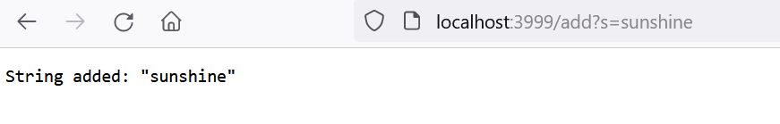
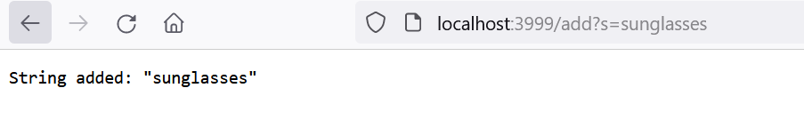
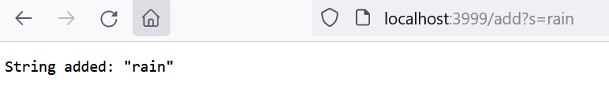
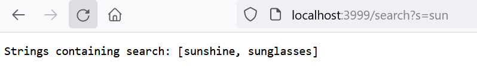

### Lab Report Week 3

#### Part 1

```
class Handler implements URLHandler {
    ArrayList<String> stringsList = new ArrayList<>();

    public String handleRequest(URI url) {
        if (url.getPath().equals("/")) {
            return String.format("Strings: " + stringsList.toString());
        }

        else {
            System.out.println("Path: " + url.getPath());
            if (url.getPath().contains("/add")) {
                String[] param = url.getQuery().split("=");
                if (param[0].equals("s")) {
                    stringsList.add(param[1]);
                    return String.format("String added: \"" + param[1] + "\"");
                }
            }

            else if (url.getPath().contains("/search")) {
                String[] param = url.getQuery().split("=");
                ArrayList<String> quer = new ArrayList<>();
                if (param[0].equals("s")) {
                    for (int i = 0; i < stringsList.size(); i++) {
                        if (stringsList.get(i).contains(param[1])) {
                            quer.add(stringsList.get(i));
                        }
                    }
                    return String.format("Strings containing search: " + quer.toString());
                }
            }

            return "404 Not Found!";
        }
    }
}

class SearchEngine {
    public static void main(String[] args) throws IOException {
        if (args.length == 0) {
            System.out.println("Missing port number! Try any number between 1024 to 49151") ;
            return;
        }

        int port = Integer.parseInt(args[0]);
        Server.start(port, new Handler());
    }
}
```



In this example, I added the String "sunshine". The handleRequest method is called, and the condition of `if (url.getPath().contains("/add"))` is true, so the contents of the if statement are executed. A String Array is created, containing the values [s, sunshine]. The following if statement `if (param[0].equals("s"))` is therefore true, and so the contents are also executed. The Handler's ArrayList field `stringsList` adds the value of `param[0]`, which is "sunshine". The method returns "String added: sunshine", which is what is shown on the page.



Next, I added the string "sunglasses". Again, the handleRequest method is called, and the same if statements as before are evaluated to be true. The difference now is that `stringsList` now adds a new value "sunglasses", and the returning String reads "String added: sunglasses" which is shown on the page.



Next, I added the string "rain". The same if statements as the two prior examples are executed, and the Handler's `stringsList` field adds a third value of "rain". Similarly to before, the method returns "String added: rain" which is what is shown on the page.



Lastly, this time I searched for the value "sun". The handleRquest method is called again, but this time the if statement `if (url.getPath().contains("/search"))` is what's evaluated to be true. The contents of this are executed, and a new String Array is created with the values [s, sun], along with a new empty ArrayList `quer`. The following if statement `if (param[0].equals("s"))` is true, and the contents are executed. The method loops through the ArrayList `stringsList` (as a reminder, this ArrayList contains the values [sunshine, sunglasses, rain], and if the given value contains the search query "sun", it is added to the new ArrayList `quer`. This therefore filters only the values containing "sun". At the end of the loop, `quer` contains [sunshine, sunglasses]. The method then returns the String "Strings containing search: [sunshine, sunglasses]" which is what is now shown on the page.
