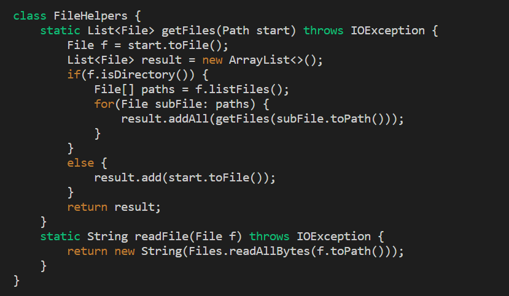
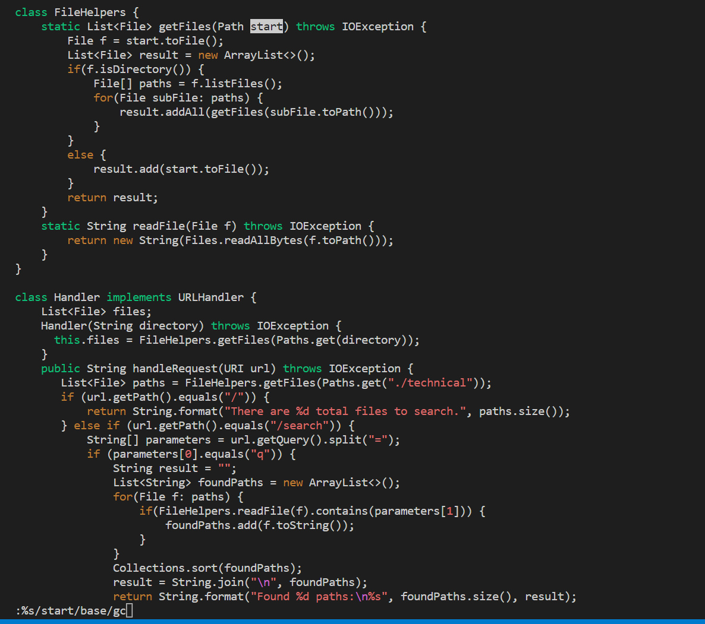
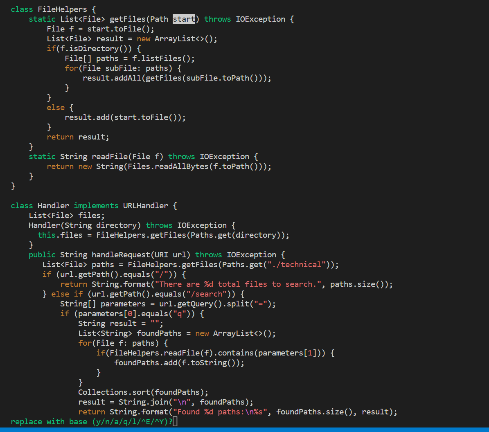
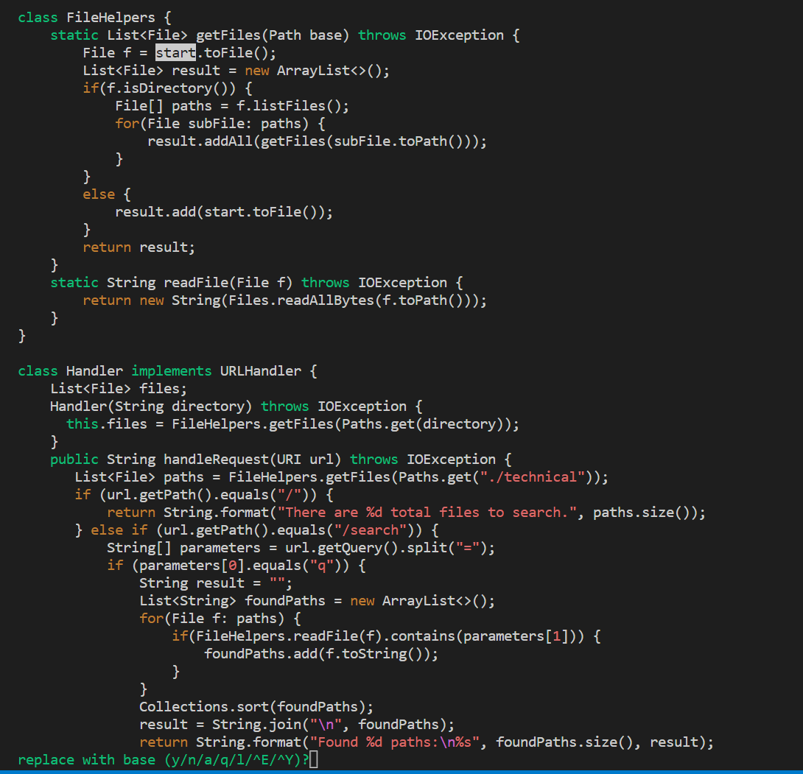
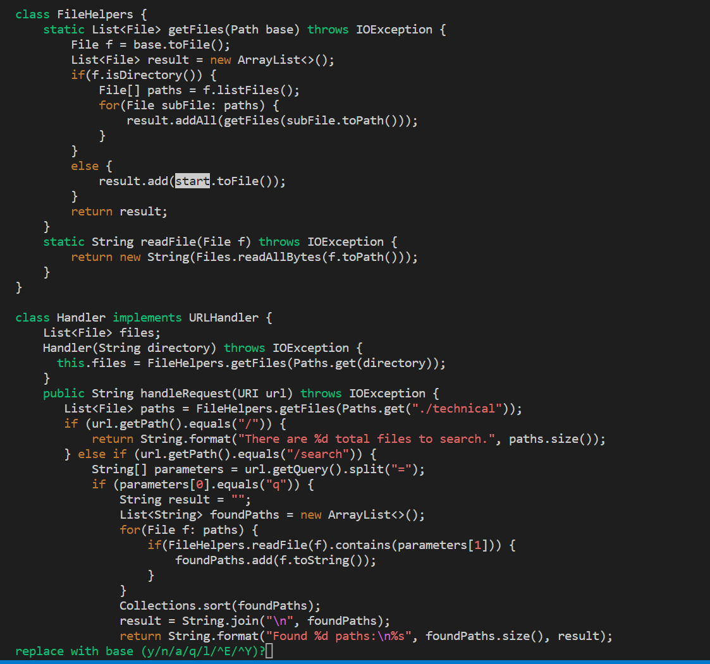
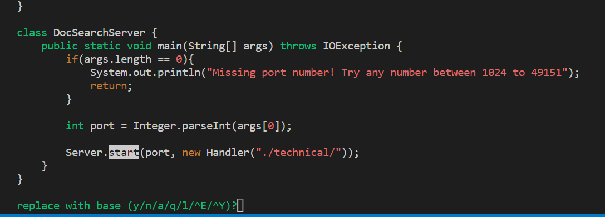
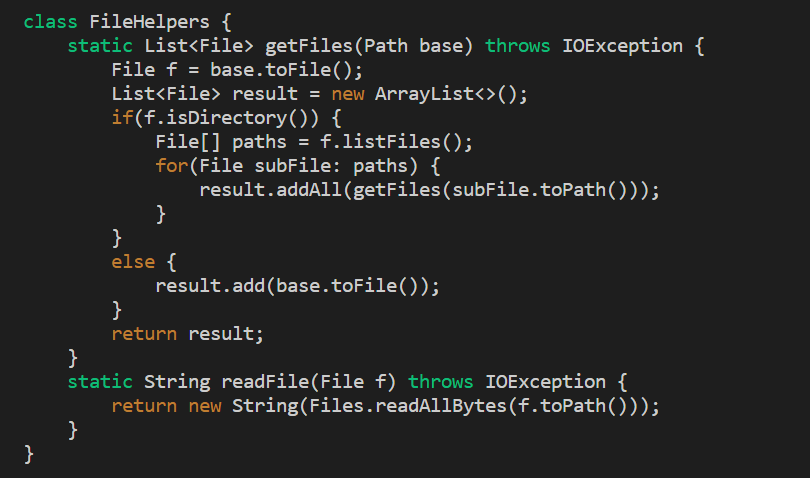
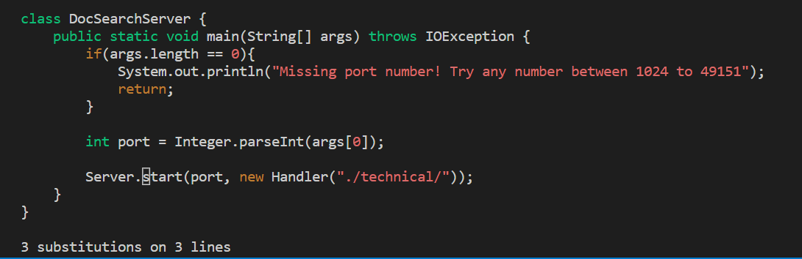

## Week 7 Lab Report

### Part 1

Task: Change the name of the start parameter and its uses to base

The Vim interface looked like this when I first opened it:

I then typed `:%s/start/base/gc<ENTER>` to tell Vim to change all instances of `start` to `base` (with confirmation).

Vim highlights the first instance of `start` and asks confirmation to change it. After pressing `y`, the next instance of `start` is highlighted and I am prompted again.

I continued pressing `y` when prompted until I reached the last instance of `start`.

I then press `n` because I do not want to change this instance of `start`, and after this Vim has completed all of my desired changes.

### Part 2

Editing locally in VSCode and using `scp` took me around 2 minutes, and editing in Vim took me around 20 seconds. Vim made it a lot easier to replace instances of `start`
because after typing the necessary code for search and replace, all I had to do was press `y` or `n`. This was quicker than editing locally because I didn't have
to find every instance of `start` manually and then select it and paste `base` in its place.

If I was working on a program that I was running remotely I would prefer to edit it locally if I was still building my methods and writing my code. This is because
Vim is more finicky to navigate, especially when you need to type large amounts of code. However, if I was mainly done with my project and I just needed to edit or
tweak things, then I think Vim would make that process a lot faster.
